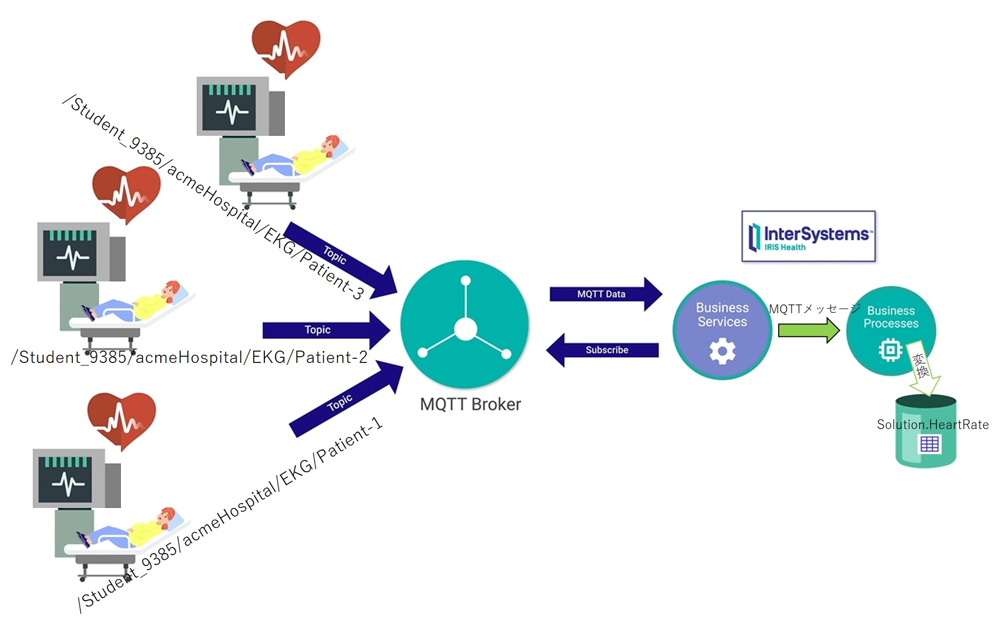

# MQTTを使った遠隔モニタリングのサンプル（IRISのMQTTアダプタの利用体験）

MQTT を使った遠隔モニタリングをテーマに、患者さんに装着した心電図から心拍数（BPM）をリアルタイムに近い状態で取得し、モニタ画面に患者さん毎の心拍数を表示します（IRIS の MQTT インバウンドアダプタを利用したメッセージの Subscribe をご体験いただけます）。

**処理のイメージ**



サンプルの動かし方について詳しくは、[【GettingStarted with IRIS】MQTT を使った遠隔モニタリング（IRIS の MQTT アダプタを試してみよう！）](https://jp.community.intersystems.com/node/505946) でご紹介しています。ぜひご参照ください。

この READMEでは、サンプル開始までの**簡易説明**をご紹介します。

## サンプル開始手順（図解付き詳細はぜひ[コミュニティの記事](https://jp.community.intersystems.com/node/505946)をご参照ください）

1) サンプルをダウンロードします

    ```
    git clone https://github.com/Intersystems-Jp/Samples-MQTT-EKG-Devices
    ```

2) サンプル用ディレクトリに移動します。

    ```
    cd Samples-MQTT-EKG-Devices
    ```

    **Windows 以外でお試しいただいている場合は、[setup.sh](./setup.sh) を実行します。**

    ```
    ./setup.sh
    ```

3) コンテナを開始します（コンテナが作成されていない場合はビルドします）。

    ```
    docker-compose up -d
    ```

4) MQTTブローカーのトピックを作成します。

    **この実行により MQTT ブローカーへ Publish するトピックが作成されます**

    ```
    docker-compose exec iris iris session iris -U %SYS "##class(App.Installer).InitializeDocker()"
    ```

    【補足】    
    IRISの起動が完了していないと、上記メソッド実行後、以下のメッセージが出力されます。

        Sign-on inhibited: Startup or Installation in progress

    このメッセージが表示される場合は、しばらく待ってから再度実行してください。

    正常に実行できると、以下のように演習環境用のトピックが表示されます。

        You have successfully initiated the MQTT exercise
        Please take note of your topic top-level string: /Student_4908/acmeHospital/EKG/#
        press enter to continue

    Enterで元の画面に戻ります。

5) プロダクションを開始

    **サーバ名はご利用環境に合わせてご変更ください**

    ユーザ名：SuperUser、パスワード：SYS でログインできます。

    http://localhost:52773/csp/INTEROP/EnsPortal.ProductionConfig.zen?$NAMESPACE=$INTEROP&PRODUCTION=Solution.MQTT

    画面を開いたら「開始する」ボタンをクリックします。


6) app.htmlを開き Publish 開始！

    **URL例のサーバ名はご利用環境に合わせてご変更ください**

    http://localhost/app.html

    この画面を開くと MQTT ブローカーへ Publish を開始します。

    患者ごとの心拍数の確認のため、ユーザポータルを開きます。

    http://localhost:52773/csp/INTEROP/_DeepSee.UserPortal.DashboardViewer.zen?DASHBOARD=SolutionEKG.dashboard

    HTML画面（app.html）の追加ボタンや心拍数を変更するスライドバーを利用するとユーザポータルの表示が変化し、IRIS の MQTT アダプタを利用して MQTT ブローカーからトピックを Subscribe していることを確認できます。


    管理ポータルの細かな操作例については、[【GettingStarted with IRIS】MQTT を使った遠隔モニタリング（IRIS の MQTT アダプタを試してみよう！）](https://jp.community.intersystems.com/node/505946) をぜひご参照ください！

7) 終了方法

    app.html を閉じることで MQTT ブローカーへの Publish を終了します。

    コンテナの停止は以下の通りです
    
    ```
    docker-compose stop
    ```

    コンテナを破棄する場合は以下の通りです。

    ```
    docker-compose down
    ```

***

## メモ

このサンプルは、[Monitoring Remotely with MQTT](https://gettingstartedhealth.intersystems.com/integrating-devices/monitoring-with-mqtt/) で公開されているサンプル：[https://github.com/intersystems/Samples-MQTT-EKG-Devices](https://github.com/intersystems/Samples-MQTT-EKG-Devices) に以下の変更を加えています。

1. タイムゾーンをTokyoに変更（[docker-compose.yml](./docker-compose.yml)）
2. Dockerfileに指定のイメージを **2021.1.0.215.3** に変更
3. コメント文の追加（Solution.HeartRate.cls／Solution.MetricMQTT.cls）
4. [app.html](./datavol/App/app.html) に説明を追記とApacheコンテナから起動できるように修正
5. IRISを日本語ロケールに変更
6. [MQTT.code-workspace](./MQTT.code-workspace)にユーザポータルとプロダクション画面のリンクを追記